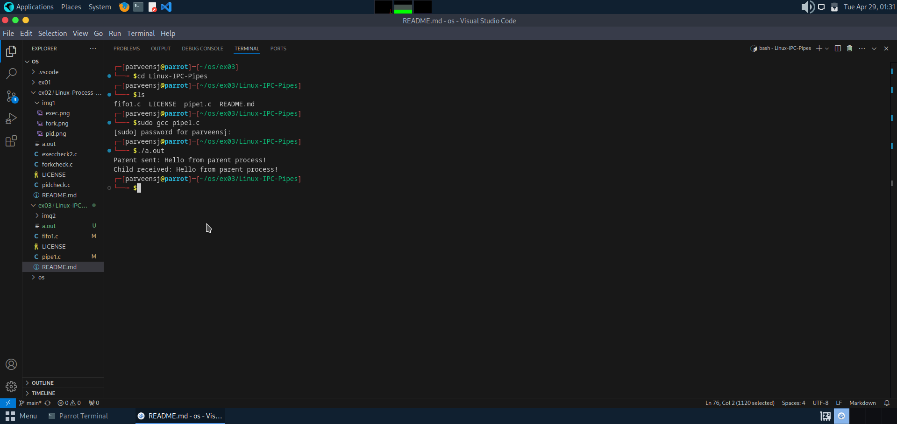
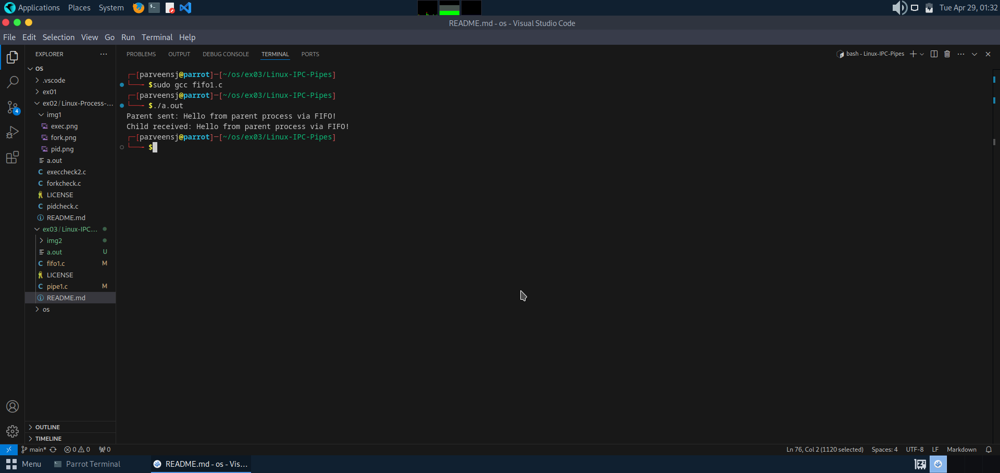

# Linux-IPC--Pipes
Linux-IPC-Pipes


# Ex03-Linux IPC - Pipes

# AIM:
To write a C program that illustrate communication between two process using unnamed and named pipes

# DESIGN STEPS:

### Step 1:

Navigate to any Linux environment installed on the system or installed inside a virtual environment like virtual box/vmware or online linux JSLinux (https://bellard.org/jslinux/vm.html?url=alpine-x86.cfg&mem=192) or docker.

### Step 2:

Write the C Program using Linux Process API - pipe(), fifo()

### Step 3:

Testing the C Program for the desired output. 

# PROGRAM:

## C Program that illustrate communication between two process using unnamed pipes using Linux API system calls
```
#include <stdio.h>
#include <stdlib.h>
#include <unistd.h>
#include <string.h>

#define BUFFER_SIZE 100

int main() {
    int pipefd[2];  // pipefd[0]: read end, pipefd[1]: write end
    pid_t pid;
    char write_msg[] = "Hello from parent process!";
    char read_msg[BUFFER_SIZE];

    // Create the pipe
    if (pipe(pipefd) == -1) {
        perror("pipe");
        exit(EXIT_FAILURE);
    }

    // Fork a child process
    pid = fork();

    if (pid < 0) {
        perror("fork");
        exit(EXIT_FAILURE);
    }

    if (pid > 0) {
        // Parent process
        close(pipefd[0]); // Close unused read end

        // Write to the pipe
        write(pipefd[1], write_msg, strlen(write_msg) + 1);
        printf("Parent sent: %s\n", write_msg);

        close(pipefd[1]); // Close write end after writing
    } else {
        // Child process
        close(pipefd[1]); // Close unused write end

        // Read from the pipe
        read(pipefd[0], read_msg, sizeof(read_msg));
        printf("Child received: %s\n", read_msg);

        close(pipefd[0]); // Close read end after reading
    }

    return 0;
}

```


## OUTPUT



## C Program that illustrate communication between two process using named pipes using Linux API system calls
```
#include <stdio.h>
#include <stdlib.h>
#include <string.h>
#include <unistd.h>
#include <fcntl.h>
#include <sys/stat.h>

#define FIFO_NAME "myfifo"
#define BUFFER_SIZE 100

int main() {
    int fd;
    char write_msg[] = "Hello from parent process via FIFO!";
    char read_msg[BUFFER_SIZE];
    pid_t pid;

    // Create the named pipe (FIFO)
    if (mkfifo(FIFO_NAME, 0666) == -1) {
        perror("mkfifo");
        // Continue even if FIFO already exists
    }

    // Fork a child process
    pid = fork();

    if (pid < 0) {
        perror("fork");
        exit(EXIT_FAILURE);
    }

    if (pid > 0) {
        // Parent process - Writer
        fd = open(FIFO_NAME, O_WRONLY);
        if (fd == -1) {
            perror("open for writing");
            exit(EXIT_FAILURE);
        }

        write(fd, write_msg, strlen(write_msg) + 1);
        printf("Parent sent: %s\n", write_msg);

        close(fd); // Close after writing
    } else {
        // Child process - Reader
        fd = open(FIFO_NAME, O_RDONLY);
        if (fd == -1) {
            perror("open for reading");
            exit(EXIT_FAILURE);
        }

        read(fd, read_msg, sizeof(read_msg));
        printf("Child received: %s\n", read_msg);

        close(fd); // Close after reading
    }

    // Optional: Parent can unlink (delete) the FIFO after use
    if (pid > 0) {
        unlink(FIFO_NAME);
    }

    return 0;
}
```


## OUTPUT



# RESULT:
The program is executed successfully.
